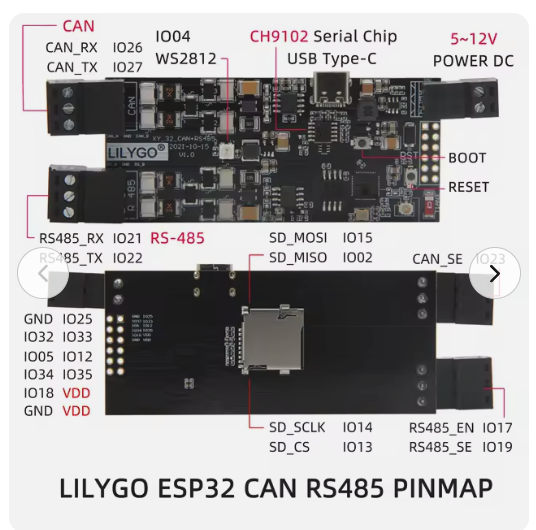

# Tesla Model Y Stationary Power Plant

This project is now focused on using Battery-Emulator as the core integration layer for a salvaged Tesla Model Y HV battery pack.

## Primary Reference
- Battery-Emulator: https://github.com/dalathegreat/Battery-Emulator
- [Web Installer](https://dalathegreat.github.io/BE-Web-Installer/) - Install factory image via Chrome/Edge browser over USB

## LilyGo T-CAN485 pinout

Pinout diagram for the LILYGO ESP32 CAN RS485 board (CAN_RX/TX, RS485, SD card, and expansion header pins):

## Documentation (docs/)

- **[LILYGO_MCP2515_WIRING_TABLE.md](docs/LILYGO_MCP2515_WIRING_TABLE.md)** – Connection table (wire colors, pinout) for LilyGo T-CAN485 ↔ MCP2515 CAN module.
- **[LILYGO_MCP2515_TROUBLESHOOTING.md](docs/LILYGO_MCP2515_TROUBLESHOOTING.md)** – MCP2515 add-on not working: pinout, CANFREQ, errors, checklist.
- [build-from-network-drive.md](docs/build-from-network-drive.md) – Building when the project is on a network drive.
- [LOCAL_COPY.md](docs/LOCAL_COPY.md) – Working from a local copy of the project.

## Next Steps
- Review Battery-Emulator supported inverter list and Tesla pack support
- Identify required hardware (board, CAN interface, contactor control)
- Map Solis 11.4kW HV inverter integration requirements to Battery-Emulator capabilities
